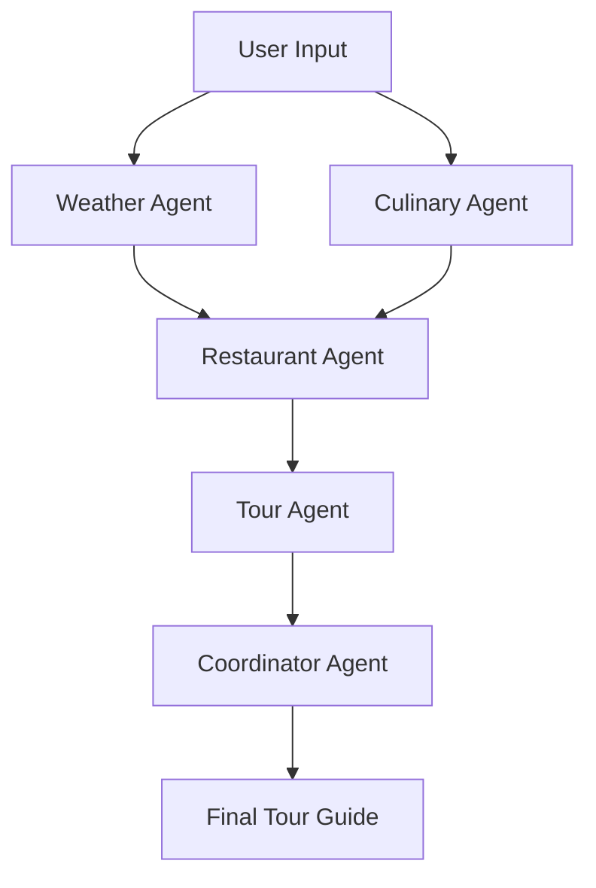

# 🍪 Foodie Tours - AI-Powered Culinary Adventures

<div align="center">

[](https://julep.ai)
[](https://streamlit.io)
[](https://python.org)
[](https://opensource.org/licenses/MIT)

*Experience the world through your taste buds with AI-crafted culinary journeys*

[🚀 Live Demo](#-quick-start) • [📚 Documentation](#-documentation) • [🤝 Contributing](#-contributing) • [💬 Support](#-support)

</div>

---

## 🌟 Overview

**Foodie Tours** is a cutting-edge AI-powered application that creates personalized culinary adventures based on real-time weather conditions and local cuisine expertise. Built with **Julep AI's multi-agent workflow system**, it combines weather intelligence with culinary knowledge to craft the perfect dining experience for any city, any time.

### ✨ What Makes This Special?

- 🌤️ **Weather-Aware Recommendations**: Suggests cozy indoor spots during rain, outdoor terraces on sunny days
- 🍽️ **Authentic Local Cuisine**: Discovers genuine local dishes, not just tourist traps  
- 🤖 **Multi-Agent AI System**: Five specialized AI agents work together for comprehensive tour planning
- 📱 **Beautiful UI**: Modern, responsive interface built with Streamlit
- 📋 **Downloadable Guides**: Take your tour offline with formatted markdown exports
- ⚡ **Real-Time Processing**: Live weather data integration for up-to-the-minute accuracy

## 🎯 Key Features

<table>
<tr>
<td>

### 🌍 Intelligent Tour Planning
- **Multi-city support** with parallel processing
- **Weather-adaptive itineraries** that adjust to conditions
- **Cultural context** and local dining customs
- **Time-optimized schedules** for breakfast, lunch, dinner

</td>
<td>

### 🍕 Culinary Intelligence  
- **Authentic dish discovery** using local knowledge
- **Restaurant quality scoring** and recommendations
- **Dietary considerations** and alternatives
- **Price range filtering** for budget-conscious travelers

</td>
</tr>
<tr>
<td>

### 🤖 AI-Powered Workflow
- **5 Specialized Agents** working in coordination
- **Real-time status updates** during generation
- **Error handling** and graceful degradation
- **Scalable architecture** for future enhancements

</td>
<td>

### 💫 User Experience
- **Intuitive interface** with sidebar navigation
- **Progress tracking** with visual indicators
- **Export functionality** for offline use
- **Responsive design** for all devices

</td>
</tr>
</table>

## 🚀 Quick Start

### Prerequisites
- Python 3.8 or higher
- API keys for Julep AI and OpenWeatherMap (both offer generous free tiers)

### 1️⃣ Clone & Install
```bash
# Clone the repository
git clone https://github.com/yourusername/foodie-tours.git
cd foodie-tours

# Install dependencies
pip install -r requirements.txt
```

### 2️⃣ Configure API Keys
```bash
# Copy the environment template
cp .env.example .env

# Edit .env with your API keys
# JULEP_API_KEY=your_julep_api_key_here
# OPENWEATHER_API_KEY=your_openweathermap_api_key_here
```

**🔑 Get Your API Keys:**
- **Julep AI**: [Get Free API Key](https://dashboard.julep.ai/home) (Generous free tier available)
- **OpenWeatherMap**: [Get Free API Key](https://openweathermap.org/api) (60 calls/minute free)

### 3️⃣ Launch the Application
```bash
streamlit run app.py
```

🎉 **That's it!** Open your browser to `http://localhost:8501` and start creating culinary adventures!

## 🏗️ Architecture & Technical Deep Dive

### 🤖 Multi-Agent Workflow System

Our application leverages **Julep AI's powerful multi-agent architecture** with five specialized agents:



| Agent | Responsibility | Key Skills |
|-------|---------------|------------|
| 🌤️ **Weather Agent** | Real-time weather analysis | Meteorological interpretation, dining style recommendations |
| 🍽️ **Culinary Agent** | Local cuisine expertise | Cultural food knowledge, dish authenticity verification |
| 🏪 **Restaurant Agent** | Venue discovery & evaluation | Quality assessment, location matching, reviews analysis |
| 📖 **Tour Agent** | Narrative creation | Storytelling, cultural insights, itinerary formatting |
| 🎯 **Coordinator Agent** | Final orchestration | Data synthesis, quality assurance, user experience optimization |

### 🔧 Tech Stack

<div align="center">

| Component | Technology | Purpose |
|-----------|------------|---------|
| **Frontend** |  | Interactive web interface |
| **AI Engine** |  | Multi-agent workflow orchestration |
| **Weather API** |  | Real-time weather data |
| **Backend** |  | Core application logic |
| **Styling** |  | Custom UI components |

</div>

### 📊 Workflow Process

1. **🌤️ Weather Analysis** → Fetch current conditions, analyze for dining preferences
2. **🍽️ Dish Discovery** → Identify 3 authentic local dishes perfect for the weather
3. **🏪 Restaurant Matching** → Find top-rated venues with appropriate atmosphere
4. **📖 Story Creation** → Generate engaging narratives with cultural context
5. **🎯 Final Assembly** → Coordinate all elements into a comprehensive guide

## 📱 Usage Guide

### Basic Usage
1. **Select Cities**: Use the sidebar to choose from popular destinations or add custom cities
2. **Generate Tours**: Click "Generate Foodie Tours" to start the AI workflow
3. **Monitor Progress**: Watch real-time updates as each agent completes their work
4. **Explore Results**: Browse beautifully formatted tour guides with weather-appropriate recommendations
5. **Download**: Export your personalized tour as a Markdown file for offline use

### Advanced Features
- **Multi-city Planning**: Generate tours for multiple cities simultaneously
- **Weather Sensitivity**: Tours automatically adapt to current weather conditions
- **Cultural Context**: Learn about local dining customs and food history
- **Time Optimization**: Get perfectly timed itineraries for your schedule

## 🎨 Screenshots

<div align="center">

| Main Interface | Tour Generation | Results View |
|:--------------:|:---------------:|:------------:|
|  |  |  |

</div>

## 📚 Documentation

### Project Structure
```
foodie-tours/
├── 📄 app.py                    # Main Streamlit application
├── 🤖 julep_service.py          # Julep AI agent management
├── 🌤️ weather_service.py        # OpenWeatherMap integration
├── 🛠️ utils.py                  # Utility functions and helpers
├── 🎨 styles.css               # Custom styling
├── 📝 example_workflow.py       # Julep workflow examples
├── 📋 requirements.txt          # Python dependencies
├── 🔒 .env.example             # Environment variables template
└── 📖 README.md                # This file
```

### Key Components

#### 🤖 Julep Service (`julep_service.py`)
Manages the multi-agent workflow system, handles agent creation, task coordination, and response processing.

#### 🌤️ Weather Service (`weather_service.py`)  
Integrates with OpenWeatherMap API to fetch real-time weather data and translate it into dining recommendations.

#### 🛠️ Utilities (`utils.py`)
Provides helper functions for UI formatting, progress tracking, data validation, and content export.

## 🚀 Deployment

### Local Development
```bash
# Development mode with auto-reload
streamlit run app.py --server.runOnSave true
```

### Production Deployment

<details>
<summary>🚀 Deploy to Streamlit Cloud</summary>

1. Push your code to GitHub
2. Connect your repository to [Streamlit Cloud](https://streamlit.io/cloud)
3. Add your API keys as secrets in the dashboard
4. Deploy with one click!

</details>

<details>
<summary>🐳 Docker Deployment</summary>

```dockerfile
# Dockerfile example
FROM python:3.9-slim
WORKDIR /app
COPY requirements.txt .
RUN pip install -r requirements.txt
COPY . .
EXPOSE 8501
CMD ["streamlit", "run", "app.py"]
```

</details>

## 🤝 Contributing

We welcome contributions! Here's how you can help:

### 🐛 Bug Reports
Found a bug? Please create an issue with:
- Clear description of the problem
- Steps to reproduce
- Expected vs actual behavior
- Screenshots if applicable

### 💡 Feature Requests
Have an idea? We'd love to hear it! Open an issue with:
- Detailed description of the feature
- Use case and benefits
- Possible implementation approach

### 🔧 Pull Requests
1. Fork the repository
2. Create a feature branch (`git checkout -b feature/amazing-feature`)
3. Commit your changes (`git commit -m 'Add amazing feature'`)
4. Push to the branch (`git push origin feature/amazing-feature`)
5. Open a Pull Request

## 📄 License

This project is licensed under the MIT License - see the [LICENSE](LICENSE) file for details.

## 💬 Support

<div align="center">

Need help? We're here for you!

[](https://github.com/yourusername/foodie-tours/issues)
[](https://discord.gg/yourdiscord)
[](mailto:your-email@example.com)

</div>

## 🌟 Acknowledgments

- **[Julep AI](https://julep.ai)** for providing the powerful multi-agent workflow platform
- **[Streamlit](https://streamlit.io)** for the amazing web app framework
- **[OpenWeatherMap](https://openweathermap.org)** for reliable weather data
- The open-source community for inspiration and support

---

<div align="center">

**Made with ❤️ and 🤖 by [Your Name]**

⭐ **Star this repo if it helped you create amazing foodie tours!** ⭐

</div>
