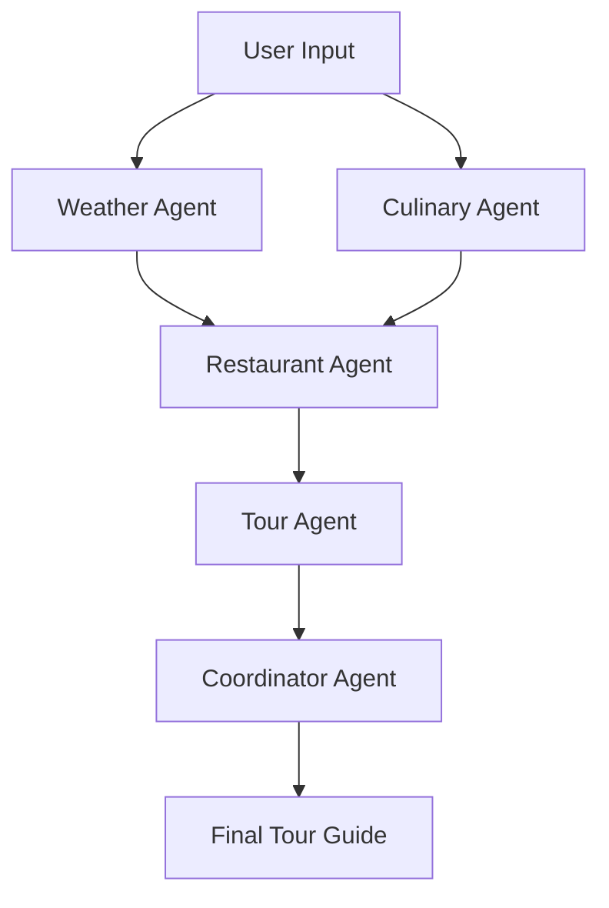
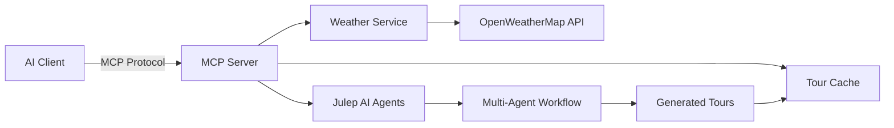
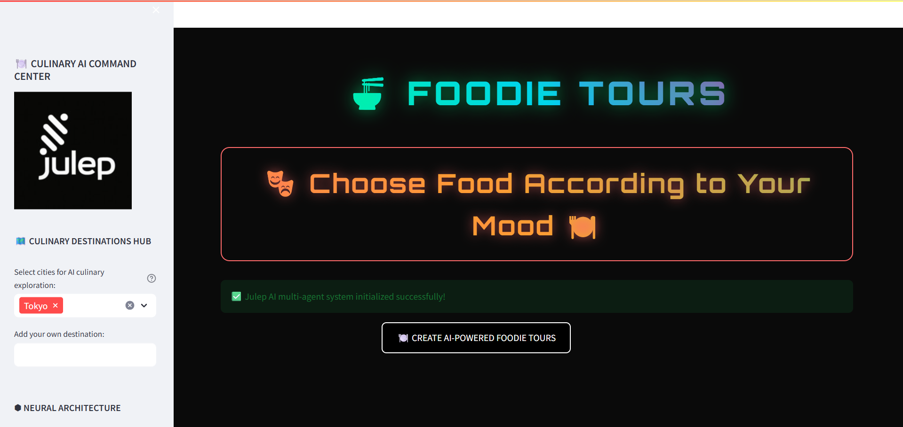
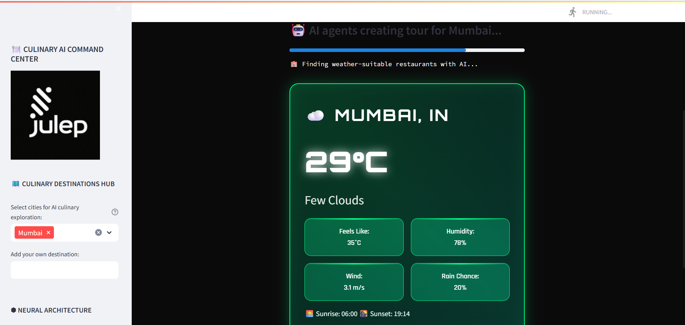
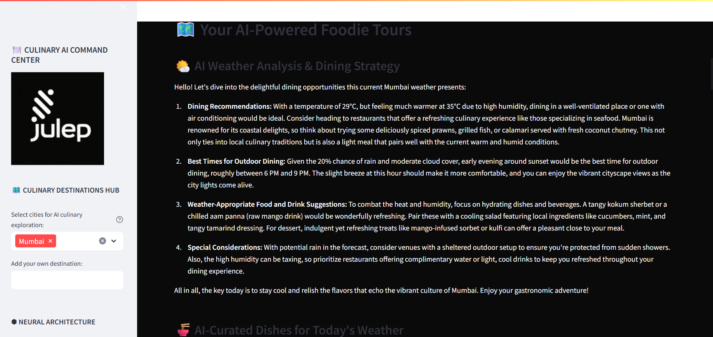
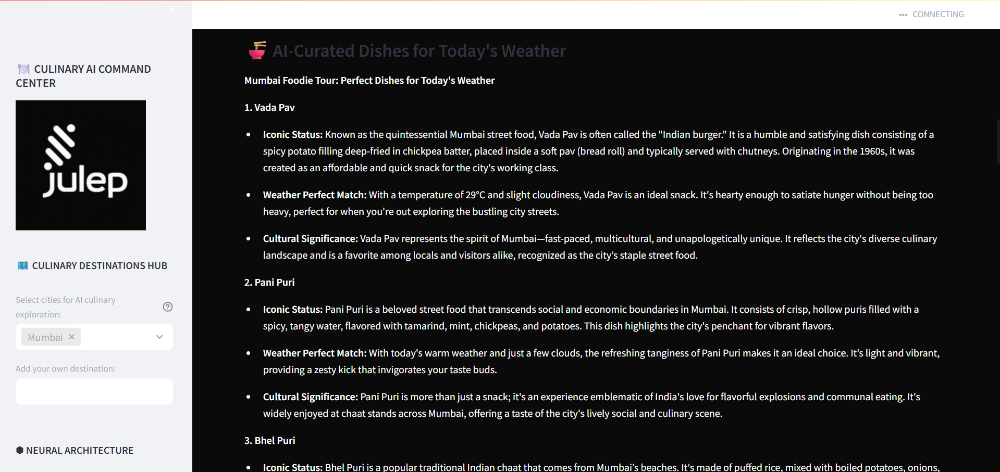
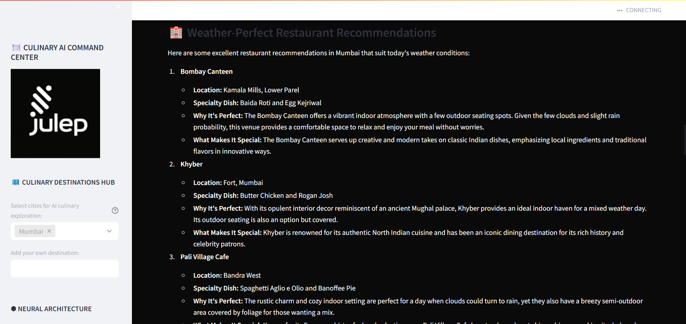

# 🍽️ Foodie Tours - AI-Powered Culinary Adventures

<div align="center">

[](https://julep.ai)
[](https://streamlit.io)
[](https://python.org)
[](https://opensource.org/licenses/MIT)

*Experience the world through your taste buds with AI-crafted culinary journeys*

[🚀 Quick Start](#-quick-start) • [📚 Documentation](#-documentation) • [🤝 Contributing](#-contributing) • [💬 Support](#-support)

</div>

---

## 📑 Table of Contents

- [🌟 Overview](#-overview)
- [🎬 Video Demo](#-video-demo)
- [🎯 Key Features](#-key-features)
- [🚀 Quick Start](#-quick-start)
- [🔌 MCP Server Integration](#-mcp-server-integration)
- [🏗️ Architecture & Technical Deep Dive](#-architecture--technical-deep-dive)
- [📱 Usage Guide](#-usage-guide)
- [🎨 Screenshots](#-screenshots)
- [📚 Documentation](#-documentation)
- [🚀 Deployment](#-deployment)
- [🤝 Contributing](#-contributing)
- [📄 License](#-license)
- [💬 Support](#-support)
- [🌟 Acknowledgments](#-acknowledgments)

---

## 🌟 Overview

**Foodie Tours** is a cutting-edge AI-powered application that creates personalized culinary adventures based on real-time weather conditions and local cuisine expertise. Built with **Julep AI's multi-agent workflow system**, it combines weather intelligence with culinary knowledge to craft the perfect dining experience for any city, any time.

### ✨ What Makes This Special?

- 🌤️ **Weather-Aware Recommendations**: Suggests cozy indoor spots during rain, outdoor terraces on sunny days
- 🍽️ **Authentic Local Cuisine**: Discovers genuine local dishes, not just tourist traps  
- 🤖 **Multi-Agent AI System**: Five specialized AI agents work together for comprehensive tour planning
- 🔌 **MCP Server Integration**: Exposes functionality to any AI assistant via Model Context Protocol
- 📱 **Beautiful UI**: Modern, responsive interface built with Streamlit
- 📋 **Downloadable Guides**: Take your tour offline with formatted markdown exports
- ⚡ **Real-Time Processing**: Live weather data integration for up-to-the-minute accuracy

## 🎬 Video Demo

<div align="center">

[](https://youtu.be/y7vN0fqqomE?si=jQGSj_PMRvPMbzLi)

*🎥 Click above to watch the full demo showcasing AI-powered culinary tour generation in action!*

**See how our multi-agent system creates personalized foodie tours based on real-time weather conditions**

</div>

## 🎯 Key Features

<table>
<tr>
<td>

### 🌍 Intelligent Tour Planning
- **Multi-city support** with parallel processing
- **Weather-adaptive itineraries** that adjust to conditions
- **Cultural context** and local dining customs
- **Time-optimized schedules** for breakfast, lunch, dinner

</td>
<td>

### 🍕 Culinary Intelligence  
- **Authentic dish discovery** using local knowledge
- **Restaurant quality scoring** and recommendations
- **Dietary considerations** and alternatives
- **Price range filtering** for budget-conscious travelers

</td>
</tr>
<tr>
<td>

### 🤖 AI-Powered Workflow
- **5 Specialized Agents** working in coordination
- **Real-time status updates** during generation
- **Error handling** and graceful degradation
- **Scalable architecture** for future enhancements

</td>
<td>

### 💫 User Experience
- **Intuitive interface** with sidebar navigation
- **Progress tracking** with visual indicators
- **Export functionality** for offline use
- **Responsive design** for all devices

</td>
</tr>
</table>

## 🚀 Quick Start

### Prerequisites
- Python 3.8 or higher
- API keys for Julep AI and OpenWeatherMap (both offer generous free tiers)

### 1️⃣ Clone & Install
```bash
# Clone the repository
git clone https://github.com/sarvottam-bhagat/Julep-AI_Assesment.git
cd Julep-AI_Assesment

# Install dependencies
pip install -r requirements.txt
```

### 2️⃣ Configure API Keys
```bash
# Copy the environment template
cp .env.example .env

# Edit .env with your API keys
# JULEP_API_KEY=your_julep_api_key_here
# OPENWEATHER_API_KEY=your_openweathermap_api_key_here
```

**🔑 Get Your API Keys:**
- **Julep AI**: [Get Free API Key](https://dashboard.julep.ai/home) (Generous free tier available)
- **OpenWeatherMap**: [Get Free API Key](https://openweathermap.org/api) (60 calls/minute free)

### 3️⃣ Launch the Application
```bash
streamlit run app.py
```

🎉 **That's it!** Open your browser to `http://localhost:8501` and start creating culinary adventures!

## 🔌 MCP Server Integration

**Foodie Tours** now includes a **Model Context Protocol (MCP) server** that exposes all application functionality to any MCP-compatible client, including Claude Desktop, IDEs, and other AI tools.

### 🚀 What is MCP?

The **Model Context Protocol** is an open standard that allows AI assistants to securely connect to external data sources and tools. Our MCP server transforms the Foodie Tours application into a powerful AI tool that can be accessed by any compatible AI client.

### ✨ MCP Server Features

| Feature | Description | Use Case |
|---------|-------------|----------|
| 🌤️ **Weather API** | Real-time weather data for any city | "Get current weather for Tokyo" |
| 🍽️ **AI Agent Chat** | Direct interaction with specialized AI agents | "Ask the culinary agent about Italian dishes" |
| 🏪 **Tour Generation** | Complete foodie tour creation with progress tracking | "Create a foodie tour for Paris" |
| 📊 **Status Monitoring** | Real-time application status and cache information | "Show me the current app status" |
| 💾 **Tour Caching** | Retrieve previously generated tours | "Get my cached tour for London" |

### 🛠️ MCP Server Tools

Our MCP server exposes the following tools:

```python
# Weather Tools
get_weather_data(city: str)           # Get current weather conditions
get_dining_recommendation(city: str)   # Weather-based dining suggestions

# AI Agent Tools  
chat_with_agent(agent_type: str, message: str)  # Direct agent communication
list_available_agents()               # View all available AI agents

# Tour Generation Tools
create_complete_foodie_tour(city: str)  # Full tour generation with progress
get_cached_tours()                    # List all cached tours
get_cached_tour(tour_key: str)        # Retrieve specific cached tour
```

### 🔧 MCP Server Setup

#### 1️⃣ Start the MCP Server
```bash
# Run the MCP server
python mcp_server.py
```

#### 2️⃣ Configure Claude Desktop (Example)
Add to your Claude Desktop configuration:
```json
{
  "mcpServers": {
    "foodie-tours": {
      "command": "python",
      "args": ["C:/path/to/your/foodie-tours/mcp_server.py"],
      "env": {
        "JULEP_API_KEY": "your_julep_api_key_here",
        "OPENWEATHER_API_KEY": "your_openweather_api_key_here"
      }
    }
  }
}
```

#### 3️⃣ Use in Any MCP Client
Once connected, you can use natural language commands:
- *"Get the current weather in Rome"*
- *"Create a complete foodie tour for Barcelona"*
- *"Ask the culinary agent about traditional French pastries"*
- *"Show me all my cached tours"*

### 🎯 MCP Server Benefits

- **🔗 Universal Integration**: Works with any MCP-compatible AI client
- **📊 Real-time Progress**: See tour generation progress in real-time
- **💾 Smart Caching**: Automatically caches tours for quick retrieval
- **🛡️ Error Handling**: Graceful degradation when services are unavailable
- **🎨 Rich Responses**: Formatted outputs with emojis and structured data

## 🏗️ Architecture & Technical Deep Dive

### 🤖 Multi-Agent Workflow System

Our application leverages **Julep AI's powerful multi-agent architecture** with five specialized agents:



| Agent | Responsibility | Key Skills |
|-------|---------------|------------|
| 🌤️ **Weather Agent** | Real-time weather analysis | Meteorological interpretation, dining style recommendations |
| 🍽️ **Culinary Agent** | Local cuisine expertise | Cultural food knowledge, dish authenticity verification |
| 🏪 **Restaurant Agent** | Venue discovery & evaluation | Quality assessment, location matching, reviews analysis |
| 📖 **Tour Agent** | Narrative creation | Storytelling, cultural insights, itinerary formatting |
| 🎯 **Coordinator Agent** | Final orchestration | Data synthesis, quality assurance, user experience optimization |

### 🔧 Tech Stack

<div align="center">

| Component | Technology | Purpose |
|-----------|------------|---------|
| **Frontend** |  | Interactive web interface |
| **MCP Server** |  | Model Context Protocol server for AI integration |
| **AI Engine** |  | Multi-agent workflow orchestration |
| **Weather API** |  | Real-time weather data |
| **Backend** |  | Core application logic |
| **Styling** |  | Custom UI components |

</div>

### 📊 Workflow Process

1. **🌤️ Weather Analysis** → Fetch current conditions, analyze for dining preferences
2. **🍽️ Dish Discovery** → Identify 3 authentic local dishes perfect for the weather
3. **🏪 Restaurant Matching** → Find top-rated venues with appropriate atmosphere
4. **📖 Story Creation** → Generate engaging narratives with cultural context
5. **🎯 Final Assembly** → Coordinate all elements into a comprehensive guide

### 🔌 MCP Server Architecture

The MCP server acts as a bridge between external AI clients and the Foodie Tours functionality:



**MCP Server Components:**
- **🔧 Tool Registry**: Exposes application functions as callable tools
- **📡 Protocol Handler**: Manages MCP communication with clients
- **🎯 Context Manager**: Provides real-time progress updates
- **💾 Cache System**: Stores and retrieves generated tours
- **🛡️ Error Management**: Handles service failures gracefully

## 📱 Usage Guide

### 🚀 Multiple Ways to Use Foodie Tours

| Interface | Best For | Command |
|-----------|----------|---------|
| 🖥️ **Web Interface** | Interactive exploration, visual experience | `streamlit run app.py` |
| 🔌 **MCP Server** | AI assistant integration, automation | `python mcp_server.py` |
| 📱 **Both Together** | Maximum flexibility and power | Run both simultaneously |

### Web Interface Usage
1. **Select Cities**: Use the sidebar to choose from popular destinations or add custom cities
2. **Generate Tours**: Click "Generate Foodie Tours" to start the AI workflow
3. **Monitor Progress**: Watch real-time updates as each agent completes their work
4. **Explore Results**: Browse beautifully formatted tour guides with weather-appropriate recommendations
5. **Download**: Export your personalized tour as a Markdown file for offline use

### MCP Server Usage
Connect any MCP-compatible AI client and use natural language:
- *"Create a foodie tour for Tokyo considering the current weather"*
- *"What's the weather like in Paris and what dining would you recommend?"*
- *"Ask the culinary agent about traditional Italian pasta dishes"*
- *"Show me my cached tours and retrieve the one for Rome"*

### Advanced Features
- **Multi-city Planning**: Generate tours for multiple cities simultaneously
- **Weather Sensitivity**: Tours automatically adapt to current weather conditions
- **Cultural Context**: Learn about local dining customs and food history
- **Time Optimization**: Get perfectly timed itineraries for your schedule
- **Cross-Platform**: Access via web browser or any MCP-compatible AI tool

## 🎨 Screenshots

### 🖥️ Main Interface


### 🚀 Tour Generation


### 📋 Results View






## 📚 Documentation

### Project Structure
```
foodie-tours/
├── 📄 app.py                    # Main Streamlit application
├── 🔌 mcp_server.py             # Model Context Protocol server
├── 🤖 julep_service.py          # Julep AI agent management
├── 🌤️ weather_service.py        # OpenWeatherMap integration
├── 🛠️ utils.py                  # Utility functions and helpers
├── 🎨 styles.css               # Custom styling
├── 📋 requirements.txt          # Python dependencies
├── 🔒 .env.example             # Environment variables template
└── 📖 README.md                # This file
```

### Key Components

#### 🔌 MCP Server (`mcp_server.py`)
Exposes Foodie Tours functionality through the Model Context Protocol, allowing any MCP-compatible AI client to access weather data, chat with AI agents, and generate complete tours with real-time progress tracking.

**Key Features:**
- **Tool Registration**: All application functions available as MCP tools
- **Progress Tracking**: Real-time updates during tour generation
- **Resource Management**: Access to app status, cache info, and service configuration
- **Error Handling**: Graceful degradation when services are unavailable

#### 🤖 Julep Service (`julep_service.py`)
Manages the multi-agent workflow system, handles agent creation, task coordination, and response processing.

#### 🌤️ Weather Service (`weather_service.py`)  
Integrates with OpenWeatherMap API to fetch real-time weather data and translate it into dining recommendations.

#### 🛠️ Utilities (`utils.py`)
Provides helper functions for UI formatting, progress tracking, data validation, and content export.

## 🚀 Deployment

### Local Development
```bash
# Development mode with auto-reload
streamlit run app.py --server.runOnSave true

# Or run MCP server for AI integration
python mcp_server.py

# Run both for maximum functionality
# Terminal 1:
streamlit run app.py
# Terminal 2:
python mcp_server.py
```

### Production Deployment

<details>
<summary>🚀 Deploy to Streamlit Cloud</summary>

1. Push your code to GitHub
2. Connect your repository to [Streamlit Cloud](https://streamlit.io/cloud)
3. Add your API keys as secrets in the dashboard
4. Deploy with one click!

</details>

<details>
<summary>🔌 Deploy MCP Server</summary>

```bash
# For production MCP server deployment
python mcp_server.py

# With process management (recommended)
nohup python mcp_server.py > mcp_server.log 2>&1 &

# Or use systemd service
sudo systemctl enable foodie-tours-mcp
sudo systemctl start foodie-tours-mcp
```

</details>

<details>
<summary>🐳 Docker Deployment</summary>

```dockerfile
# Dockerfile example
FROM python:3.9-slim
WORKDIR /app
COPY requirements.txt .
RUN pip install -r requirements.txt
COPY . .

# Expose both Streamlit and MCP server ports
EXPOSE 8501
EXPOSE 8000

# Start both services
CMD ["sh", "-c", "python mcp_server.py & streamlit run app.py"]
```

</details>

## 🤝 Contributing

We welcome contributions! Here's how you can help:

### 🐛 Bug Reports
Found a bug? Please create an issue with:
- Clear description of the problem
- Steps to reproduce
- Expected vs actual behavior
- Screenshots if applicable

### 💡 Feature Requests
Have an idea? We'd love to hear it! Open an issue with:
- Detailed description of the feature
- Use case and benefits
- Possible implementation approach

### 🔧 Pull Requests
1. Fork the repository
2. Create a feature branch (`git checkout -b feature/amazing-feature`)
3. Commit your changes (`git commit -m 'Add amazing feature'`)
4. Push to the branch (`git push origin feature/amazing-feature`)
5. Open a Pull Request

## 📄 License

This project is licensed under the MIT License - see the [LICENSE](LICENSE) file for details.

## 💬 Support

<div align="center">

Need help? We're here for you!

[](https://github.com/sarvottam-bhagat/Julep-AI_Assesment/issues)
[](https://discord.gg/hUnGcazv)
[](mailto:sarvottambhagat38@gmail.com)

</div>

## 🌟 Acknowledgments

- **[Julep AI](https://julep.ai)** for providing the powerful multi-agent workflow platform
- **[FastMCP](https://github.com/jlowin/fastmcp)** for the excellent Model Context Protocol implementation
- **[Streamlit](https://streamlit.io)** for the amazing web app framework
- **[OpenWeatherMap](https://openweathermap.org)** for reliable weather data
- **[Anthropic](https://anthropic.com)** for pioneering the Model Context Protocol standard
- The open-source community for inspiration and support

---

<div align="center">

**Made with ❤️ and 🤖 by Sarvottam Bhagat**

*Bringing AI-powered culinary adventures to everyone, everywhere - through web interfaces and AI assistants alike!*

⭐ **Star this repo if it helped you create amazing foodie tours!** ⭐

</div>
